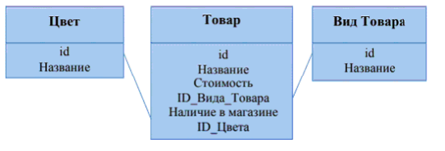

# Лабораторная работа №3. Работа с базами данных

1. Представьте таблицы (согласно вашему варианту) в виде структур языка Python
2. Реализуйте в консоли интерфейс по добавлению, удалению, изменению данных. Имейте в виду, что связанные операции (удаление, добавление, изменение) для связанных таблиц, должны изменять данных во всех связанных структурах.
3. Реализуйте функционал по сохранению данных в файлы формата .csv и считыванию информации из файлов

№ варианта | Выведите следующую информацию в консоль построчно: | Посчитайте и выведите результат: |
--- | --- | --- |
14 | Для каждого товара: «номер товара, «название товара», «стоимость товара», «цвет товара» | Для каждого цвета: количество товаров.

