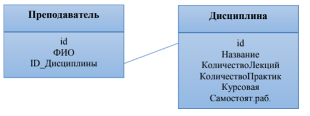

# Лабораторная работа №4. Связанные структуры данных

1. Пусть дана база данных (приведена ниже). Используйте нужные структуры данных для ее хранения. Заполните БД. Выведите список всех преподавателей.
2. Для БД из задания 1 выведите список всех дисциплин преподавателя «Иванов И.И.», по которым предусмотрена курсовая работа и самостоятельная работа.
3. Для БД из задания 1 выведите все дисциплины, в чьем названии встречается буква «П».

